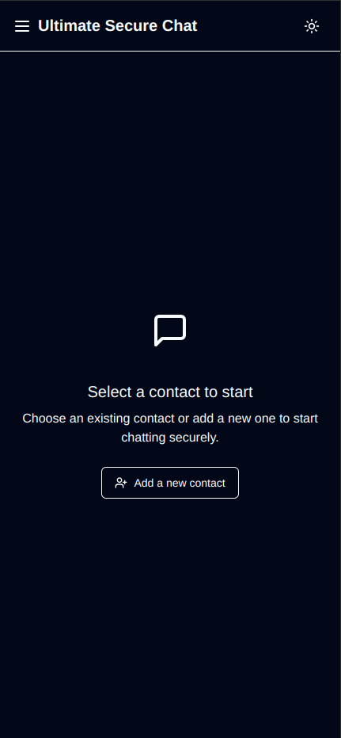

# Ultimate Secure Chat

A secure, decentralized, end-to-end encrypted chat application that respects your privacy.

[](https://github.com/manuelLandreau/ultimate-secure-chat)
[](https://ultimate-secure-chat.vercel.app)
[](https://github.com/manuelLandreau/ultimate-secure-chat/actions/workflows/deploy.yml)



> **Note**: This application was created for educational purposes to demonstrate secure communication principles and cryptographic implementations in web applications.

> **Try it now**: Access the [live demo](https://ultimate-secure-chat.vercel.app) to see the application in action!

## Features

- **End-to-End Encryption (E2EE)** - All messages are encrypted on the sender's device and decrypted only on the recipient's device.
- **P2P Communication** - Direct communication between users without a central server.
- **Modern User Interface** - Responsive and intuitive user interface.
- **Progressive Web App (PWA)** - Works offline and can be installed on mobile and desktop.
- **Zero Backend** - No server, no database, no tracking. Your data stays on your device.
- **File Sharing** - Send and receive files and images.
- **Open Source** - The code is fully open and available for review.

## Technologies Used

- **React** - UI library
- **TypeScript** - Static typing
- **Vite** - Build tool
- **TailwindCSS** - Utility-first CSS framework
- **Web Crypto API** - Client-side cryptography
- **IndexedDB / LocalStorage** - Local storage
- **WebRTC** - P2P communication

## Technical Architecture

### Cryptography

Ultimate Secure Chat uses a hybrid cryptography model:

1. **Asymmetric (RSA)**: Each user generates an RSA-4096 key pair on first startup.
2. **Symmetric (AES)**: For each message, a temporary AES-256 key is generated.
3. **Encryption Process**:
   - The message is encrypted with the temporary AES key.
   - The AES key is encrypted with the recipient's RSA public key.
   - The encrypted message and encrypted key are sent together.
4. **Decryption Process**:
   - The recipient decrypts the AES key with their RSA private key.
   - The message is decrypted with the decrypted AES key.

No private key ever leaves the user's device. Messages can only be read by the sender and the intended recipient.

### P2P Communication

La communication pair-à-pair est établie en utilisant des connexions WebRTC directes sans serveurs de signalisation ni serveurs ICE:

1. Chaque utilisateur génère un identifiant unique lors de la connexion.
2. L'utilisateur peut partager son adresse IP avec d'autres pour établir une connexion directe.
3. L'échange d'offres et de réponses WebRTC se fait manuellement pour établir la connexion.
4. Les données échangées via le canal de données WebRTC sont déjà chiffrées par le chiffrement de bout en bout.
5. Aucun serveur tiers n'est utilisé (ni serveur de signalisation, ni serveur STUN/TURN), garantissant une confidentialité maximale et une décentralisation complète.

## Installation and Execution

### Live Demo

You can try the application without installation by visiting the [live demo](https://ultimate-secure-chat.vercel.app).

### Prerequisites

- Node.js 18+ and npm

### Installation

```bash
# Clone the repository
git clone https://github.com/manuelLandreau/ultimate-secure-chat.git
cd ultimate-secure-chat

# Install dependencies
npm install

# Run in development mode
npm run dev

# Build for production
npm run build
```

## Deployment

The application can be deployed on any static hosting:

```bash
# Build for production
npm run build

# Files are located in the dist/ folder
```

## Security

- **Décentralisation complète**: Aucun serveur central, de signalisation ou ICE (STUN/TURN) n'est utilisé.
- **No Central Server**: No server that could be compromised.
- **Local Encryption**: All cryptographic operations are performed locally.
- **Locally Generated Keys**: Keys never leave your device.
- **Open Source Code**: Code is available for inspection.

## Limitations

- **Availability**: Both users must be online at the same time to exchange messages.
- **Message Durability**: Messages are only stored locally and may be lost if local storage is cleared.
- **Browser Compatibility**: Requires a modern browser supporting WebRTC and Web Crypto APIs.
- **Connectivité directe nécessaire**: En raison de l'absence de serveurs ICE (STUN/TURN), les connexions ne peuvent être établies que:
  * Entre utilisateurs sur le même réseau local
  * Lorsqu'au moins un des utilisateurs a une adresse IP publique directement accessible
  * Quand les routeurs/pare-feu permettent d'établir des connexions entrantes

## License

This project is distributed under the MIT License. See the `LICENSE` file for more information.

## Tests

Ce projet comprend des tests unitaires et des tests fonctionnels (end-to-end) :

### Tests Unitaires

Les tests unitaires sont écrits avec Vitest et la bibliothèque Testing Library.

```bash
# Exécuter tous les tests unitaires
npm test

# Exécuter les tests en mode watch (pour le développement)
npm run test:watch

# Exécuter les tests avec l'interface utilisateur
npm run test:ui

# Exécuter les tests avec couverture
npm run test:coverage
```

### Tests End-to-End

Les tests fonctionnels sont écrits avec Cypress.

```bash
# Ouvrir l'interface graphique de Cypress
npm run cypress:open

# Exécuter les tests en mode headless
npm run cypress:run
```

## Intégration Continue

Ce projet utilise GitHub Actions pour l'intégration continue. À chaque push et pull request sur la branche `main`, les tests unitaires et fonctionnels sont automatiquement exécutés.

Le workflow CI effectue les opérations suivantes :
1. Exécution des tests unitaires
2. Compilation du projet
3. Exécution des tests end-to-end avec Cypress

Vous pouvez voir les derniers résultats des tests dans l'onglet "Actions" du dépôt GitHub.
